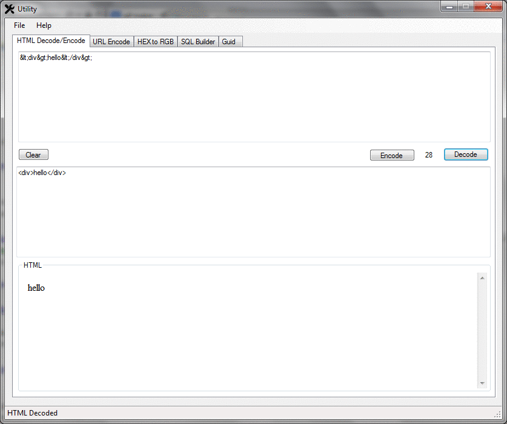

# Utility
.NET App with helper functions for day to day jobs

* I'm also creating a Mac Version: [Utility-Mac](https://github.com/AlexHedley/Utility-Mac)

Here's a quick Gif showing the different tabs in the App

There are the following tabs 
* HTML Encode/Decode 
* URL Encode 
* HEX to RGB 
* SQL Builder (IN Clause)
* Guid 
* JSON Pretty
* XML Pretty
* SQL Formatter

It also contains a HELP (.chm) file to further explain the tabs and functions.
