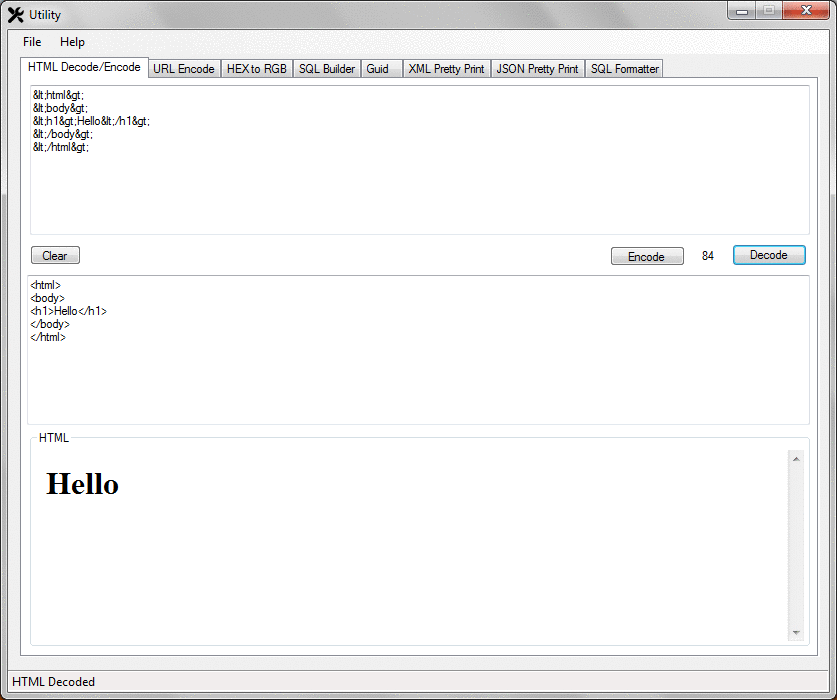

# Utility
.NET App with helper functions for day to day jobs

Here's a quick Gif showing the different tabs in the App

There are the following tabs 
* HTML Encode/Decode 
* URL Encode 
* HEX to RGB 
* SQL Builder (IN Clause)
* Guid 
